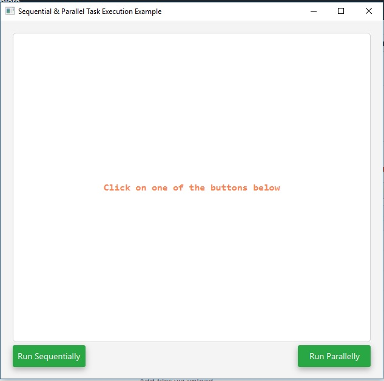
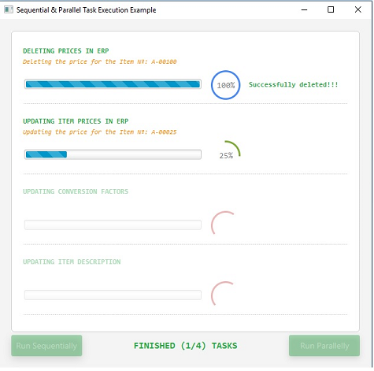
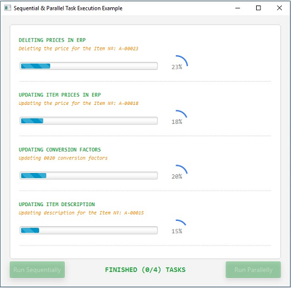


## Sequential Taks
This is a little example of how to implement a dialog that shows several taks running sequentially and parallelly.

### Initial Stage
When the app runs the initial screen is the following



### Tasks running sequentially

This is how it shows



### Tasks running parallely

This is how it shows





