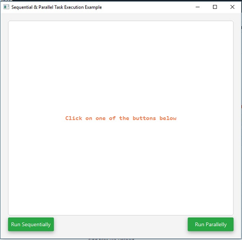


## Sequential Taks
This is a little example of how to implement a dialog that shows several taks running sequentially and parallelly.

#### Initial Stage
When the app runs the initial screen is the following



#### Tasks running sequentially




#### Tasks running parallely





#### Showing errors

If a error occurs a ***link*** will be shown



That links leads to a dialog which displays the ***message*** and the ***trace***.